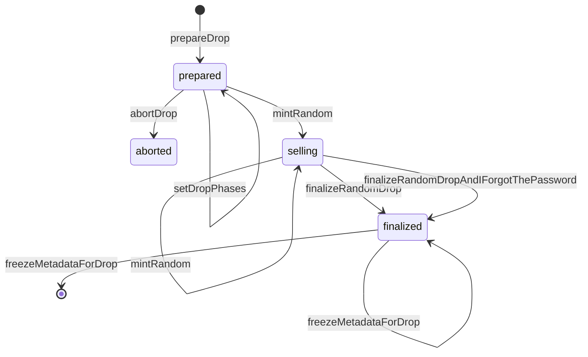
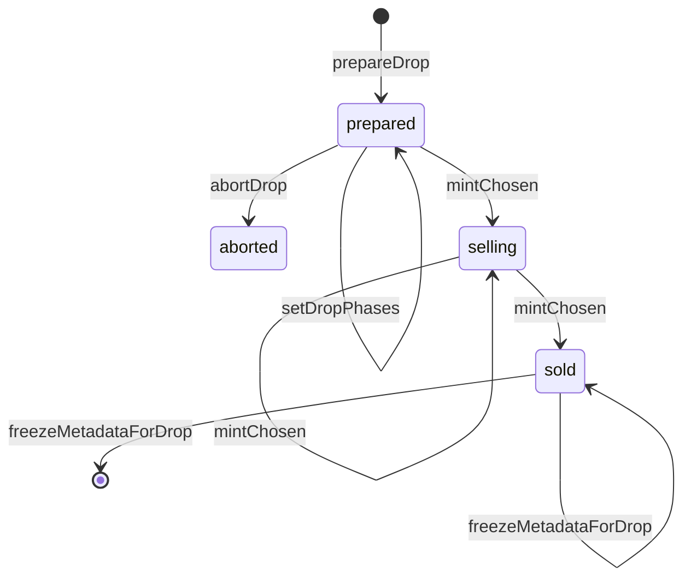

# Light Ethereum Contracts

:moneybag: ACTIVE BUG BOUNTY, SEE THE FILE [BUG-BOUNTY.md](BUG-BOUNTY.md).

Deployed: Ethereum Mainnet 0x06903cc35c37f90b4a9ef38b0b037262a327f83b

## Introduction

**Light NFT contract**

This is an ERC-721 NFT contract which provides the following features:

1. **Access control** is split into [three separate officers](contracts/ThreeChiefOfficers.sol) so that administrators will have [least privilege](Principle of least privilege) when performing privileged actions. An `ownable` [EIP-5313 (DRAFT)](https://github.com/ethereum/EIPs/pull/5313) implementation lets marketplaces know which account to recognize for configuring the contract on their platform.
2. Minting is separated into distinct **drops** which can run simultaneously.
   1. Drops can have the metadata known at mint time or **randomized** after selling out and being finalized by an administrator.
   2. Sale price is in Ether and can be configured with a self-running schedule ("**drop phases**").
   3. Every drop phase can use an **access list** with allowed mint amount, and the lists are reusable.
3. Metadata is permanent and **unchangeable** after any drop is sold out and finalized. Conformance is made to `event PermanentURI(string, uint256)` expected by OpenSea.
4. **Royalties** preferences are reported using [ERC-2981](https://eips.ethereum.org/EIPS/eip-2981) and administrative control is reported using `function owner() returns (address)` with the intention that third-party marketplaces can use these to levy and remit royalties.

Sales process for random drops:



Sales process for non-random drops:



## Deploy

1. Deploy the NFT contract
2. Deploy the marketplace contract, referencing the NFT contract

## Run test suite

Install prerequisites for macOS

```sh
# Install Homebrew
brew install node nvm yarn
```

Setup

```sh
nvm install 16 # https://nodejs.org/en/about/releases/
nvm use 16
yarn install
```

Now run this each time you change contracts or test scripts:

```sh
npm run prepare
npm run lint # note, we do not use Prettier style for Solidity
FORCE_COLOR=1 ENABLE_GAS_REPORT=true npm run test
npm run test:inheritance
npm run coverage
```

## Contributing

When the Light contracts are deployed, this repository will stay to provide documentation and context for the code. Test cases and documentation may be updated, but the code will be fixed.

Please send pull requests to improve documentation and test cases. Please send issues for anything that might be improved.

## References

- Uses [best practices for developing Solidity projects](https://github.com/fulldecent/solidity-template)
- Great implementation examples for setting up automated testing are maintained in the [OpenZeppelin Contracts project](https://github.com/OpenZeppelin/openzeppelin-contracts)
- Hardhat is preferred for building
- A good review of setting up your editor to use tools here is provided [by Yarn](https://yarnpkg.com/getting-started/editor-sdks)
- Set up VS Code
  - See [Hardhat + Mocha notes](https://hardhat.org/guides/vscode-tests.html)
- Style
  - Follow automated test cases and Solidity style guide, especially use NatSpec everywhere
- Use the contract name in every revert message
